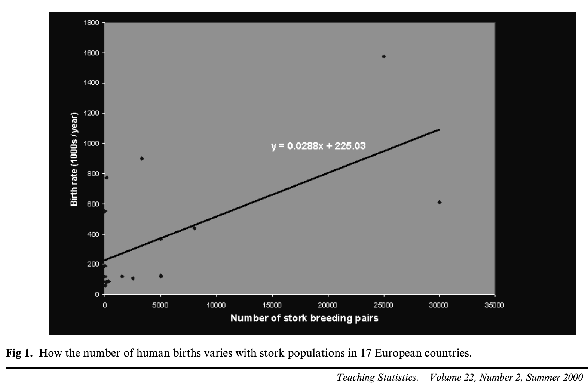

## Bravo d'être là! {.center}

{width=65%}

## Confirmez votre présence!

::: {.r-fit-text}
[https://forms.office.com/Pages/ResponsePage.aspx?id=1Yt3Vj9q00uiZZMWPk1b_px4nrtttv9Dj3VfEaM2bBVUNDFYQjIxWTUwUkFGUlNMWFJCRTE1R1dOVSQlQCN0PWcu](https://forms.office.com/Pages/ResponsePage.aspx?id=1Yt3Vj9q00uiZZMWPk1b_px4nrtttv9Dj3VfEaM2bBVUNDFYQjIxWTUwUkFGUlNMWFJCRTE1R1dOVSQlQCN0PWcu)
:::

## Qui suis-je?

- Doctorant en science politique (directeur : Yannick Dufresne)
- Co-coordonnateur de la CLESSN (Chaire de leadership en enseignement des sciences sociales numériques)
- Co-coordonnateur du CAPP (Centre d'analyses des politiques publiques)
- Cocréateur de l'EIOM (École interdisciplinaire Outils & Méthodes — [eiom.ca](https://eiom.ca/))
- Certified Scrum Master & Notion certified
- Membre du GRCP, CÉCD, OVBIA, CIEQ

## Plan de la journée

**9h à 12h — Formation théorique**

1.  Rappel de la semaine passée
2.  Visualisation : ggplot2
3.  Analyse textuelle automatisée avec R
4.  Régression linéaire
5.  *BONUS — R et l'IA : comment travailler intelligemment*

**13h à 15h — Atelier pratique** *(présentiel seulement)*

-   Travaillez avec vos propres données et questions de recherche
-   Exercices disponibles sur le site de l'atelier

---

# Rappel de la semaine passée

## La semaine passée avec Étienne

Tout le contenu d'Étienne est disponible ici :

::: {.r-fit-text}
[etienneproulx.org/R_intro_fss](https://www.etienneproulx.org/R_intro_fss/)
:::

. . .

On fait un **survol rapide** (~30 min) pour rafraîchir les mémoires.
Si vous avez besoin de revoir en détail, le site d'Étienne est là.

## Une ressource incontournable

**Hadley Wickham** est le créateur de `tidyverse` — c'est lui qui a inventé `ggplot2`, `dplyr`, `tidyr` et la plupart des outils qu'on utilise aujourd'hui.

Son livre ***R for Data Science*** est **gratuit en ligne** et couvre tout le cycle de l'analyse de données :

> Importer → Organiser → Transformer → Visualiser → Modéliser → Communiquer

. . .

Le chapitre [**Workflow: basics**](https://r4ds.hadley.nz/workflow-basics.html) est un excellent point de départ pour consolider les bases — nommage des objets, conventions de style, bonnes pratiques.

::: {.r-fit-text}
[r4ds.hadley.nz](https://r4ds.hadley.nz/)
:::

## R & RStudio : l'interface

::: {.columns}
::: {.column width="50%"}
**4 panneaux :**

1. **Script** (en haut à gauche) — votre code
2. **Console** (en bas à gauche) — l'exécution
3. **Environnement** (en haut à droite) — vos objets
4. **Fichiers / Graphiques** (en bas à droite)
:::

::: {.column width="50%"}
**Règle fondamentale :**

Écrivez toujours dans le **script**, pas dans la console.

`Ctrl + Enter` (Win) / `Cmd + Enter` (Mac) pour exécuter une ligne.
:::
:::

## Objets et assignation

```{r}
# Créer un objet avec <-
mon_nombre <- 42
mon_texte  <- "Bonjour"
mon_vecteur <- c(1, 5, 3, 8, 2)

# Appeler un objet : taper son nom
mon_vecteur

# Fonctions de base
mean(mon_vecteur)
max(mon_vecteur)
length(mon_vecteur)
```

. . .

**Types principaux :** `numeric`, `character`, `logical` (`TRUE`/`FALSE`)

```{r}
class(mon_nombre)   # "numeric"
class(mon_texte)    # "character"
```

## Packages et importation

```{r}
# Installer une fois, charger à chaque session
install.packages("tidyverse")   # dans la console
library(tidyverse)              # dans le script

# Importer un fichier CSV
mes_donnees <- read.csv("fichier.csv")

# Explorer un data frame
glimpse(mes_donnees)
names(mes_donnees)
mes_donnees$nom_colonne    # accéder à une colonne
```

## Les données : Gapminder

```{r}
library(gapminder)
glimpse(gapminder)
```

::: {.fragment}
```
Rows: 1,704  |  Columns: 6
$ country    "Afghanistan", "Afghanistan", …
$ continent  Asia, Asia, …
$ year       1952, 1957, …
$ lifeExp    28.8, 30.3, …
$ pop        8425333, 9240934, …
$ gdpPercap  779.4, 820.9, …
```
:::

## Le pipe : `|>`

Le pipe **enchaîne** les opérations. Lisez-le comme *« puis »*.

```{r}
# Sans pipe
arrange(filter(gapminder, year == 2007), desc(lifeExp))

# Avec pipe — bien plus lisible
gapminder |>
  filter(year == 2007) |>
  arrange(desc(lifeExp))
```

**Raccourci :** `Ctrl + Shift + M` (Win) / `Cmd + Shift + M` (Mac)

## Les 6 verbes de dplyr — rappel éclair

| Verbe | Action | Exemple |
|---|---|---|
| `filter()` | Garder des lignes | `filter(year == 2007)` |
| `select()` | Garder des colonnes | `select(country, lifeExp)` |
| `mutate()` | Créer / modifier | `mutate(pib_mil = pop * gdpPercap)` |
| `arrange()` | Trier | `arrange(desc(lifeExp))` |
| `rename()` | Renommer | `rename(pays = country)` |

## `group_by()` + `summarise()`

```{r}
gapminder |>
  filter(year == 2007) |>
  group_by(continent) |>
  summarise(esperance_moy = mean(lifeExp), nb_pays = n())
```

## Revoir les exercices d'Étienne?

::: {.r-fit-text}
[etienneproulx.org/R_intro_fss/exercices.html](https://www.etienneproulx.org/R_intro_fss/exercices.html)
:::

---

# 1. Visualisation avec ggplot2

## La logique de ggplot2

ggplot2 est basé sur une **grammaire des graphiques** : on assemble des couches.

```{r}
ggplot(data = gapminder,         # 1. les données
       aes(x = gdpPercap,        # 2. les axes et couleurs (aesthetics)
           y = lifeExp)) +
  geom_point()                   # 3. le type de graphique (geom)
```

. . .

Les éléments de base :

-   `ggplot()` — initialise le graphique
-   `aes()` — mappe les variables aux propriétés visuelles
-   `geom_*()` — choisit le type de figure
-   `+` — ajoute des couches (pas un pipe!)

## Nuage de points : geom_point()

```{r}
gapminder |>
  filter(year == 2007) |>
  ggplot(aes(x = gdpPercap,
             y = lifeExp,
             color = continent,   # couleur par continent
             size = pop)) +       # taille par population
  geom_point(alpha = 0.7) +       # alpha = transparence
  scale_x_log10() +               # axe X en échelle log
  labs(
    title  = "PIB per capita et espérance de vie (2007)",
    x      = "PIB per capita (échelle log)",
    y      = "Espérance de vie (années)",
    color  = "Continent",
    size   = "Population"
  ) +
  theme_minimal()
```

## Graphique en barres : geom_col()

```{r}
gapminder |>
  filter(year == 2007) |>
  group_by(continent) |>
  summarise(esperance_moy = mean(lifeExp)) |>
  ggplot(aes(x = reorder(continent, esperance_moy),
             y = esperance_moy,
             fill = continent)) +
  geom_col(show.legend = FALSE) +
  coord_flip() +                  # barres horizontales
  labs(
    title = "Espérance de vie moyenne par continent (2007)",
    x     = "Continent",
    y     = "Espérance de vie (années)"
  ) +
  theme_minimal()
```

## Histogramme : geom_histogram()

```{r}
gapminder |>
  filter(year == 2007) |>
  ggplot(aes(x = lifeExp,
             fill = continent)) +
  geom_histogram(bins = 30, alpha = 0.7) +
  labs(
    title = "Distribution de l'espérance de vie (2007)",
    x     = "Espérance de vie (années)",
    y     = "Nombre de pays",
    fill  = "Continent"
  ) +
  theme_minimal()
```

## Personnaliser et sauvegarder

```{r}
mon_graphique <- gapminder |>
  filter(year == 2007) |>
  ggplot(aes(x = gdpPercap, y = lifeExp, color = continent)) +
  geom_point(alpha = 0.7) +
  scale_x_log10() +
  theme_minimal() +
  theme(
    plot.title    = element_text(size = 16, face = "bold"),
    legend.position = "bottom"
  ) +
  labs(title = "Mon graphique")

# Sauvegarder
ggsave("graphique.png", plot = mon_graphique, width = 10, height = 7, dpi = 300)
```

---

# 2. Analyse textuelle automatisée

## Pourquoi en sciences sociales?

Les sciences sociales sont riches en données **textuelles** :

-   Entrevues et groupes focaux
-   Réponses ouvertes à des sondages
-   Publications sur les réseaux sociaux
-   Articles de journaux et discours politiques
-   Documents gouvernementaux

. . .

**Le problème :** des centaines ou milliers de textes, impossible à analyser manuellement.

**La solution :** l'analyse textuelle automatisée avec R.

## Deux approches complémentaires

| Approche | Outils | Usage |
|---|---|---|
| **Manuelle** | NVivo, Atlas.ti | Analyse qualitative fine, petits corpus |
| **Automatisée** | R (stringr, tidytext) | Grandes quantités de texte, patterns |

. . .

Aujourd'hui on fait de l'**automatisé** — mais les deux se complètent!

## Nos données textuelles

```{r}
library(tidyverse)

# Exemple : réponses à une question ouverte de sondage sur les
# priorités politiques (traduit en anglais pour l'analyse de sentiment)
reponses <- tibble(
  id       = 1:8,
  auteur   = c("Répondant A", "Répondant B", "Répondant C", "Répondant D",
               "Répondant E", "Répondant F", "Répondant G", "Répondant H"),
  texte    = c(
    "The government must invest more in clean energy and protect the environment",
    "The cost of living crisis is terrible, prices are too high for working families",
    "Our healthcare system needs urgent reform and more funding immediately",
    "I appreciate the government's efforts on climate change and housing affordability",
    "Education should be free and accessible to all young people in this country",
    "The economy is struggling and the government has failed to address inflation",
    "We need stronger social programs and better support for vulnerable communities",
    "This government's terrible policies have destroyed our economic opportunities"
  )
)
```

## 4.1 stringr : manipulation de texte

stringr fait partie de **tidyverse** — pas besoin d'installation supplémentaire.

```{r}
# Les fonctions principales
texte <- "Le Parti libéral, le Parti conservateur et le Bloc québécois"

# Convertir en minuscules
str_to_lower(texte)

# Détecter un patron (retourne TRUE/FALSE)
str_detect(texte, "libéral")

# Compter les occurrences
str_count(texte, "Parti")

# Remplacer
str_replace_all(texte, "Parti", "parti")

# Extraire selon un patron
str_extract_all(texte, "Parti \\w+")
```

## stringr avec un data frame

```{r}
textes_politiques <- tibble(
  titre = c(
    "Le Parti libéral annonce un budget déficitaire",
    "Le Bloc québécois défend l'autonomie du Québec",
    "Le NPD propose de hausser le salaire minimum",
    "Le Parti conservateur critique les dépenses du gouvernement",
    "Le Parti libéral investit dans le logement abordable"
  )
)

# Compter les mentions de "Parti libéral"
textes_politiques |>
  mutate(
    mention_liberal = str_detect(titre, "libéral|Libéral"),
    nb_mots         = str_count(titre, "\\w+"),
    titre_min       = str_to_lower(titre)
  )
```

## 4.2 tidytext : tokenisation

**Tokeniser** = découper un texte en unités (mots, phrases, n-grammes).

```{r}
install.packages("tidytext")
library(tidytext)

# Tokeniser nos réponses de sondage
mots <- reponses |>
  unnest_tokens(
    output = mot,   # nom de la nouvelle colonne
    input  = texte  # colonne à découper
  )

# Résultat : une ligne par mot
mots
```

::: {.fragment}
```
# A tibble: 80 × 3
   id    auteur       mot
 1     1 Répondant A  the
 2     1 Répondant A  government
 3     1 Répondant A  must
...
```
:::

## Enlever les mots vides (stop words)

Les **mots vides** (stop words) sont fréquents mais sans signification : *the, a, is, in...*

```{r}
# Mots vides intégrés à tidytext (en anglais)
data(stop_words)

# Enlever les mots vides
mots_propres <- mots |>
  anti_join(stop_words, by = c("mot" = "word"))

# Voir les mots restants
mots_propres |>
  count(mot, sort = TRUE) |>
  slice_head(n = 10)
```

::: {.fragment}
Pour le français : `stopwords::stopwords("fr")` ou le package `stopwords`
:::

## Visualiser les mots fréquents

```{r}
mots_propres |>
  count(mot, sort = TRUE) |>
  slice_head(n = 15) |>
  ggplot(aes(x = reorder(mot, n), y = n)) +
  geom_col(fill = "#003875") +
  coord_flip() +
  labs(
    title = "15 mots les plus fréquents dans les réponses",
    x     = "Mot",
    y     = "Fréquence"
  ) +
  theme_minimal() +
  theme(plot.title = element_text(face = "bold"))
```

## 4.3 Analyse de sentiment

L'analyse de sentiment mesure le **ton** d'un texte (positif, négatif, neutre).

Principe : associer chaque mot à un score de sentiment à partir d'un **lexique**.

```{r}
# Plusieurs lexiques disponibles dans tidytext
# - "bing"  : positif / négatif
# - "afinn" : score de -5 à +5
# - "nrc"   : émotions (peur, joie, colère...)

# Charger le lexique bing
bing <- get_sentiments("bing")

# Voir les premières entrées
bing |>
  slice_head(n = 10)
```

## Calculer le sentiment par répondant

```{r}
# Joindre les mots avec le lexique
sentiment_par_auteur <- mots_propres |>
  inner_join(bing, by = c("mot" = "word")) |>
  count(auteur, sentiment) |>
  pivot_wider(
    names_from  = sentiment,
    values_from = n,
    values_fill = 0
  ) |>
  mutate(score_net = positive - negative)

sentiment_par_auteur
```

## Visualiser le sentiment

```{r}
sentiment_par_auteur |>
  ggplot(aes(x = reorder(auteur, score_net),
             y = score_net,
             fill = score_net > 0)) +
  geom_col(show.legend = FALSE) +
  scale_fill_manual(values = c("firebrick", "#2ca25f")) +
  coord_flip() +
  geom_hline(yintercept = 0, linetype = "dashed") +
  labs(
    title    = "Ton des réponses par répondant",
    subtitle = "Score net = mots positifs − mots négatifs",
    x        = "Répondant",
    y        = "Score de sentiment net"
  ) +
  theme_minimal()
```

## 3.4 Wordcloud

```{r}
install.packages("wordcloud")
library(wordcloud)

# Compter les mots (après avoir enlevé les stop words)
freq <- mots_propres |>
  count(mot, sort = TRUE)

# Générer le nuage de mots
set.seed(42)
wordcloud(
  words  = freq$mot,
  freq   = freq$n,
  min.freq    = 1,
  max.words   = 50,
  random.order = FALSE,
  colors = brewer.pal(8, "Dark2")
)
```

---

# 3. Régression linéaire

## Pourquoi la régression?

But : mesurer l'**association** entre une variable dépendante $Y$ et une ou plusieurs variables indépendantes $X$.

. . .

$$Y = \beta_0 + \beta_1 X_1 + \beta_2 X_2 + \varepsilon$$

. . .

Exemples en sciences sociales :

- Le revenu prédit-il l'intention de vote?
- Le genre influence-t-il la perception des politiciens?
- L'éducation est-elle associée à la participation citoyenne?

## Deux types de variables

**Catégorielles** — nombre de catégories prédéfini

- Nominales : pas d'ordre (*religion, langue*)
- Ordinales : ordre logique (*niveau d'éducation*)
- → Doivent être converties en `factor` avec `as.factor()`

. . .

**Numériques** — valeurs continues

- Intervalles / ratio : âge, revenu, score sur 10
- → Doivent être en `numeric`

```{r}
class(ma_variable)        # vérifier le type
as.factor(ma_variable)    # convertir en catégorielle
as.numeric(ma_variable)   # convertir en numérique
```

## Nettoyer les variables avant la régression

```{r}
# Les valeurs manquantes doivent être codées NA (pas -99 ou 999)
Data$revenu <- Data$revenu_brut
Data$revenu[Data$revenu_brut == -99] <- NA

# Vérifier avec summary
summary(Data$revenu)

# Vérifier les catégories d'une variable
table(Data$genre)
```

## Régression linéaire simple

```{r}
# lm(variable_dependante ~ variable_independante, data = ...)
modele <- lm(lifeExp ~ gdpPercap, data = gapminder)

summary(modele)
```

**Lire les résultats :**

- **Estimate** : l'effet de X sur Y (pente)
- **p-value** (`Pr(>|t|)`) : significativité statistique — cherchez les `*`
- **R²** : proportion de variance expliquée (0 à 1)

## Régression multiple

```{r}
# Ajouter des variables avec +
modele_multiple <- lm(
  lifeExp ~ gdpPercap + pop + continent,
  data = gapminder |> filter(year == 2007)
)

summary(modele_multiple)
```

. . .

Chaque coefficient = effet de cette variable **en contrôlant pour toutes les autres**.

## Tableau de régression avec modelsummary

```{r}
install.packages("modelsummary")
library(modelsummary)

# Tableau comparant deux modèles
modelsummary(
  list("Modèle simple"   = modele,
       "Modèle multiple" = modele_multiple),
  stars = TRUE,
  output = "tableau_regression.docx"   # exporte en Word!
)
```

. . .

`modelsummary` exporte en Word, PDF, HTML, Excel — parfait pour vos mémoires et articles.

## Corrélation ≠ causalité

{width=55%}

. . .

Nombre de naissances ~ nombre de cigognes par pays (*p* = 0.008). Pas de causalité : variable confondante = taille du pays.

---

# BONUS : R et l'IA

## La révolution (et ses limites) {.center}

::: {.r-fit-text}
L'IA peut écrire du code R.
:::

::: {.fragment}
::: {.r-fit-text}
Mais elle peut aussi se tromper.
:::
:::

::: {.fragment}
::: {.r-fit-text}
**Votre travail : comprendre et valider.**
:::
:::

## La règle d'or

> « Pour utiliser l'IA avec R, il faut comprendre R. »

-   L'IA génère du code **plausible**, pas toujours **correct**
-   Elle ne connaît pas **vos données** spécifiques
-   Elle peut utiliser des fonctions **obsolètes** ou **mal adaptées**
-   Elle peut inventer des fonctions qui **n'existent pas** *(hallucinations)*

. . .

**La bonne nouvelle :** avec les bases solides que vous avez, vous pouvez lire, comprendre et corriger du code généré par IA.

## RStudio et l'IA : les limites

RStudio est excellent pour apprendre R, mais son intégration IA est **limitée** :

-   Pas d'autocomplétion IA native
-   Pas de suggestion de code en temps réel
-   Le plugin Copilot pour RStudio est expérimental et instable

. . .

**Pour travailler sérieusement avec l'IA**, deux alternatives s'imposent :

::: {.columns}
::: {.column width="50%"}
**[Positron](https://positron.posit.co/)** *(recommandé)*

Nouvel IDE de Posit (les créateurs de RStudio), conçu pour R et Python — intégration GitHub Copilot native.
:::
::: {.column width="50%"}
**[VS Code](https://code.visualstudio.com/)**

Éditeur universel très populaire — extensions R + GitHub Copilot disponibles.
:::
:::

## GitHub Copilot — gratuit pour les étudiants 🎓

GitHub Copilot est une IA qui **complète votre code en temps réel** dans l'éditeur, comme un collègue qui connaît tout par cœur.

**Pour y accéder gratuitement :**

1.  Créez un compte GitHub avec votre adresse universitaire
2.  Demandez le [**GitHub Student Developer Pack**](https://education.github.com/pack) — inclut Copilot + des dizaines d'outils gratuits
3.  Installez [Positron](https://positron.posit.co/) ou [VS Code](https://code.visualstudio.com/)
4.  Connectez Copilot dans l'éditeur

## Le workflow avec l'IA

::: {.columns}
::: {.column width="50%"}
**1. Formuler une demande précise**

```
Contexte : j'ai un data frame R avec
les colonnes "pays", "annee", "pib",
"esperance_vie" et "continent".

Tâche : avec tidyverse, crée un nuage
de points montrant la relation entre
pib (axe x, échelle log) et
esperance_vie (axe y), coloré par
continent, pour l'année 2007 seulement.
```
:::

::: {.column width="50%"}
**2. Lire le code avant de l'exécuter**

Posez-vous ces questions :

-   Est-ce que je reconnais les fonctions?
-   Le nom des colonnes correspond-il à mes données?
-   Y a-t-il des `install.packages()`?
-   Ça fait bien ce que je veux?

**3. Exécuter ligne par ligne**

Pas tout d'un coup! Ligne par ligne pour repérer les erreurs.

**4. Corriger et adapter**
:::
:::

## Erreurs communes de l'IA en R

| Problème | Exemple |
|---|---|
| Nom de fonction inventé | `dplyr::filter_where()` |
| Version obsolète | `gather()` au lieu de `pivot_longer()` |
| Nom de colonne incorrect | `data$Pays` au lieu de `data$pays` |
| Package non installé | Oublie de mentionner `install.packages()` |
| Logique incorrecte | `filter(year = 2007)` au lieu de `==` |

. . .

**Votre meilleur outil de validation :** lire l'aide d'une fonction avec `?filter` ou `help(filter)`

---

# Un cadeau! 🎁

## Abonnement DataCamp gratuit 🎁

::: {.r-fit-text}
[Cliquez ici pour activer votre accès gratuit](https://www.datacamp.com/groups/shared_links/eb5c78c872a775f17d2d2434b1ecd255b594b2c31ad701348869257e693c8515)
:::

Des centaines de cours en R, Python, SQL, statistiques et science des données — **gratuit pour vous**.

## Vos ressources essentielles

**Apprendre R en faisant :**

-   [swirl](https://swirlstats.com/) — tutoriels interactifs dans RStudio
-   [R for Data Science](https://r4ds.hadley.nz/) — LE livre, gratuit en ligne (Hadley Wickham)
-   [Text Mining with R](https://www.tidytextmining.com/) — analyse textuelle, gratuit en ligne

**Aide rapide :**

-   [Cheatsheet dplyr](https://rstudio.github.io/cheatsheets/html/data-transformation.html)
-   [Cheatsheet ggplot2](https://rstudio.github.io/cheatsheets/html/data-visualization.html)
-   [Stack Overflow](https://stackoverflow.com/questions/tagged/r) — communauté R

**IA + R :**

-   [Claude](https://claude.ai) ou [ChatGPT](https://chatgpt.com) — assistants de code
-   Règle d'or : toujours valider le code avant de faire confiance aux résultats

## Le contenu de cet atelier est sur GitHub

::: {.r-fit-text}
**[github.com/clessn/atelier-fss-20mars2026](https://github.com/clessn)**
:::

Vous y trouverez :

-   Ces slides (HTML)
-   Le script R pour l'atelier pratique (`exercices.R`)
-   Les données utilisées

## L'EIOM — notre école de méthodes

- **Interdisciplinaire** : sciences sociales, droit, gestion...
- 5 éditions depuis 2020
- 5 jours intensifs, 3 crédits
- Prochaine édition à l'automne

::: {.r-fit-text}
[eiom.ca](https://eiom.ca/)
:::

---

# 13h à 15h : Atelier pratique

## Comment fonctionne l'atelier

**Présentiel seulement**

1.  Ouvrez le script `exercices.R` depuis GitHub
2.  Travaillez à votre rythme — les exercices sont organisés en sections
3.  Posez vos questions! Je circule.

. . .

**Vous avez vos propres données?**

Profitez-en pour les explorer avec les outils d'aujourd'hui.
Je vous aide à adapter le code à votre contexte.

. . .

**Les exercices couvrent :**

-   Manipulation avec dplyr (gapminder)
-   Visualisation avec ggplot2
-   Analyse textuelle (stringr + tidytext)
-   BONUS : régression linéaire

## Merci! {.center}

::: columns
::: {.column width="60%"}
Des questions?

**Adrien Cloutier**\
[adrien.cloutier.1\@ulaval.ca](mailto:adrien.cloutier.1@ulaval.ca)\
[adriencloutier.com](https://adriencloutier.com)
:::

::: {.column width="40%"}


:::
:::
